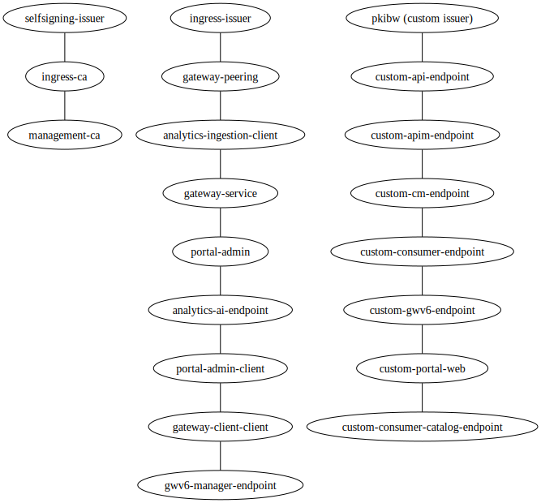
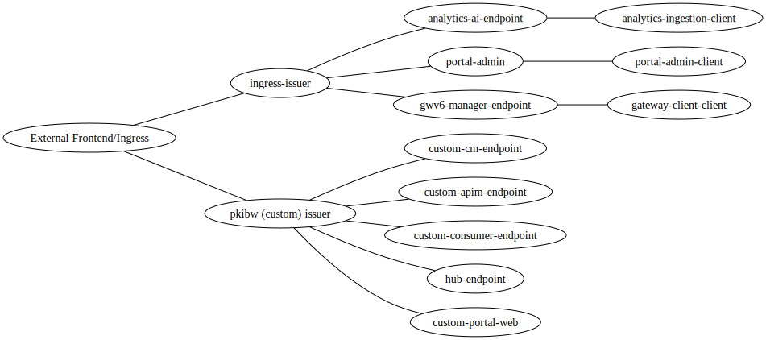
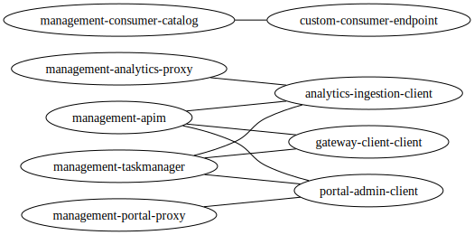

# API-Connect certificates

https://www.ibm.com/docs/en/api-connect/10.0.8?topic=deployment-overview-endpoints-certificates

https://www.ibm.com/docs/en/api-connect/10.0.8?topic=environment-custom-certificates-kubernetes

Certificates



Certificates and endpoints



Pods and certificates in Mangement subsystem



```
kubectl get cert \
--sort-by metadata.creationTimestamp \
-o custom-columns=\
NAME:metadata.name,\
ISSUER:spec.issuerRef.name
```

```
kubectl get pod \
--field-selector status.phase=Running \
-o custom-columns=\
NAME:metadata.name,\
VOLUME:spec.volumes[*].secret.secretName
```
